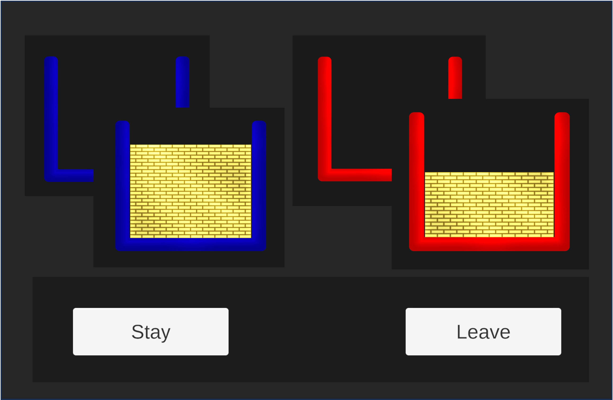

# Patch-LSD

Unity implementation of  <a  href="https://doi.org/10.1038/ncomms12327"  target="_blank">Marco Wittman's Patch Foraging Task</a>:

<small> A reinforcement learning foraging task developed to elucidate switching behaviour (Leave Stay Decisions) as a function of time linked reward rates.

<small>*Click <a  href="https://tom-gilbertsons-lab.github.io/patchLSD/"  target="_blank">here</a> to play online*

## Description
Intended to be a portable-ish OS/ device agnostic version of this task; to allow diverse teams (clinical, academic) to collect data easily. This version also contains optional EEG streaming via  <a  href="https://labstreaminglayer.readthedocs.io/index.html"  target="_blank">LSL's</a> (Lab Streaming Layer) custom Unity package,  <a  href="https://github.com/labstreaminglayer/LSL4Unity"  target="_blank">LSL4Unity</a>.

## Notes
Unity 2D Project; very basic entry-level C#.\
Builds tested on for webGL, Mac, Windows & Linux (the EEG LSL stream has only been tested on Windows). As of Feb 2025; iOS/android not tested.

A functional  <a  href="https://tom-gilbertsons-lab.github.io/patchLSD/"  target="_blank">web version</a> is available for use (no EEG). [Behavioural data](/TASK/Data) can be downloaded by the user at the end of the task (and at set points throughout).

## Task
See [here](/TASK.md) for full details on the actual task and programmatic implementation.

## Getting Started
To build a version for use in your lab; Download Unity (& dependencies); download this repo & build.\
There are executables bundled with the releases for Windows, Mac & Linux (& [WebGL](/docs)).
If you just want to run through the task, a web version is available <a  href="https://tom-gilbertsons-lab.github.io/patchLSD/"  target="_blank">here</a>.

### Dependencies

 <a  href="https://unity.com/releases/editor/whats-new/2022.3.16"  target="_blank">Unity 2022.3.16f1</a> (2D: URP)\
  <a  href="https://labstreaminglayer.readthedocs.io/index.html"  target="_blank">LSL4Unity</a> (Lab Streaming Layer as a Unity package)

## Help
Feel free to contact [@i-brnrd](https://github.com/i-brnrd) on here or via [University of Dundee](https://www.dundee.ac.uk/people/isla-barnard).

## Authors
[Isla Barnard](https://i-brnrd.github.io) (developer)\
Mihaela Lyustkanova (designed EEG integration)\
[Marco Wittman](https://www.wittmann-lab.com/contact) (original concept)\
[Tom Gilbertson](https://tom-gilbertsons-lab.github.io) (lead)

## Citation
If you use this, please cite the original paper:

* Wittmann, M., Kolling, N., Akaishi, R. et al. Predictive decision making driven by multiple time-linked reward representations in the anterior cingulate cortex. Nat Commun 7, 12327 (2016). https://doi.org/10.1038/ncomms12327

Please also consider citing this repo (note the DOI resolves to the latest version:)

* Barnard, I., Lyutskanova, M., Wittmann, M., & Gilbertson, T. (2025). Patch-LSD, Zenodo. https://doi.org/10.5281/zenodo.14977005

## Acknowledgments
To [Marco Wittman](https://www.wittmann-lab.com/contact) for <a  href="https://doi.org/10.1038/ncomms12327"  target="_blank">Predictive decision making driven by multiple time-linked reward representations in the anterior cingulate cortex</a>

## License (MIT)
See [here](/LICENSE).
