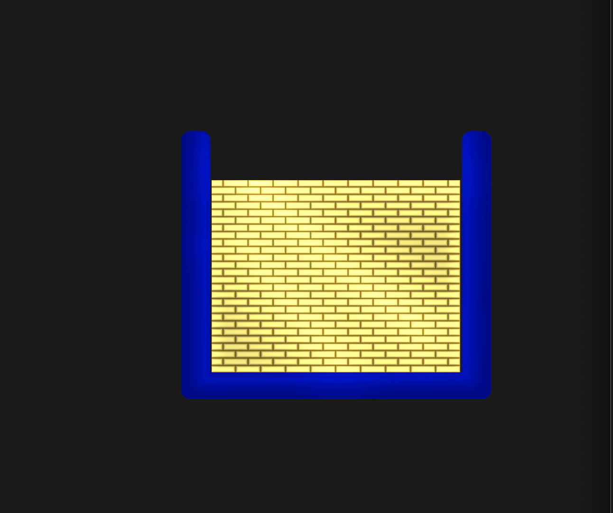
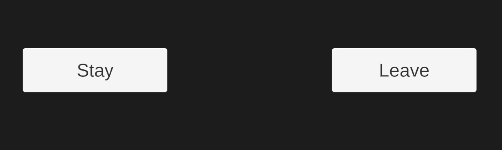

# Patch-LSD (Leave Stay Decision)

Unity implementation of the [Patch Foraging Task](https://doi.org/10.1038/ncomms12327) (Marco Wittmann, 2016) designed to investigate the influence of time linked reward rates on switching behaviour.\
This document also details the minor differences in functionality between device builds and the <a  href="https://tom-gilbertsons-lab.github.io/patchLSD/"  target="_blank">web version</a>.

### Contents
* [Overview](#overview)
* [Patches](#patches-reward-data)
* [Training](#training)
    * [Training A](#training-a)
    * [Training B](#training-b)
    * [Training C](#training-b)
* [Task](#task-1)
    * [Pausing](#pausing)
    * [Presentation Orders](#order-randomisation)
    * [Data Out](#data)
        * [Behavioural (Choice) Data](#behavioural-data)
        * [EEG Stream](#eeg-data)

## Overview
For context, read the <a  href="https://doi.org/10.1038/ncomms12327"  target="_blank">original paper</a> and play a few rounds of the task in the <a  href="https://tom-gilbertsons-lab.github.io/patchLSD/"  target="_blank">web version</a>.

On load, the Main Menu will appear, with two modes available, [Training (A, B & C)](#training) & [Task](#task-1).\

**Task Summary**\
Participants are presented with patches containing rewards, presented at different rates.\
Patches (coloured boxes) consist of non-reward events (empty boxes) and reward events (boxes with gold bars). Between events, a fixation cross is shown.

**Blue (Changing) Environment:**\
The **blue box** indicates a patch with a changing reward rate (i.e. the rate changes with timestep).

| Empty Box| Reward Box (level varies) |
| --- | --- |
|  |  |

**Red (Default) Environment:**\
The **red box** indicates a stable (default) reward rate that participants learn during [training](#training).
| Empty Box| Reward Box (level varies) |
| --- | --- |
|  |  |

After a (varying) number of events in a **blue** (changing) patch, participants are asked to decide whether to stay in that **blue** (changing) patch, or leave to go to a **red** (default) patch via a leave-stay decision.

 

## Patches/ Reward Data
* Raw reward schedules sourced from [Marco Wittmann's original data](Assets/Resources/RewardData/), visualised [here](/Assets/Resources/Literature/MarcoRR.html).
    * 5 patches per curve were  <a  href="https://doi.org/10.1038/ncomms12327"  target="_blank"> generated</a> from 18 reward rate curves; resulting in [90 patches](/Assets/Resources/RewardData/).
* Rewards are scaled from  $0 \leq R \leq 0.35$  in the [original datasets](/Assets/Resources/RewardData/) to $0 \leq R \leq 1$.
* Unity scripts (C#) use zero-based indexing, output data follows one-based indexing (MATLAB convention).

## Play
On devices, pausing via <kbd>Esc</kbd> allows return to main menu.\
On web; just click away from the browser to paause.

## Training
*Note: Training sessions do not record data.*

Training familiarises participants with the task, and the stable reward rate in the default (red) environment.\
The training options A, B & C are set out in the <a  href="https://static-content.springer.com/esm/art%3A10.1038%2Fncomms12327/MediaObjects/41467_2016_BFncomms12327_MOESM821_ESM.pdf"  target="_blank"> supplementary material</a> of the <a  href="https://doi.org/10.1038/ncomms12327"  target="_blank">original paper</a>. The [participant instructions](/Assets/Resources/Instructions/) give details on delivery.

### Training A:

[Training A](/Assets/Scripts/TrainingAController.cs) familiarises participants with the default (red) patch reward rate. See <a  href="https://static-content.springer.com/esm/art%3A10.1038%2Fncomms12327/MediaObjects/41467_2016_BFncomms12327_MOESM821_ESM.pdf"  target="_blank"> supplementary material</a> for further details.\
Participants are presented with 10 trials, comprising two patches of 15 events (so 30 events per trial).
First the **red** (default) enviroment is presented, then the **blue** (changing) environment. Following this, the participant is prompted to indicate which environment was preferred.\
The 10 length matched patches are presented in the order below:

 $$ \text{Trials A } \coloneqq\{18, 42, 86, 27, 65, 39, 76, 4, 13, 53\}$$

    int[] trialsA = { 17, 41, 85, 26, 64, 38, 75, 3, 12, 52 };

 The rewards presented in Training A use [ldgo.csv](/Assets/Resources/RewardData/ldgo.csv) for **red** (default) and [ldstay.csv](/Assets/Resources/RewardData/ldstay.csv) for  **blue** (changing).

### Training B:
[Training B](/Assets/Scripts/TrainingBController.cs) familiarises participants with monotonically changing reward rates.  See <a  href="https://static-content.springer.com/esm/art%3A10.1038%2Fncomms12327/MediaObjects/41467_2016_BFncomms12327_MOESM821_ESM.pdf"  target="_blank"> supplementary material</a> for further details.\
Participants are presented with 3 repeats of a set of 3 'full' **blue** (changing) patches:

$$\text{Trials B } \coloneqq \{8, 42, 82\}$$

    int[] trialsB = { 7, 41, 81 };

The rewards presented in Training B use a full **blue** (changing) patch- a given patch rewards runs through [rew2ld.csv](/Assets/Resources/RewardData/rew2ld.csv) and then onto  [ldstay.csv](/Assets/Resources/RewardData/ldstay.csv),  with no Leave-Stay decision presented.

During the first set, participants are asked to pay attention to the change in reward magnitudes (ignoring delays). In the second set, participants are asked to pay attention to the change of reward delays (ignoring reward magnitudes), and in the final set, to the changes in both magnitudes and delays.

### Training C:
[Training C](/Assets/Scripts/TrainingCController.cs) is a shortened version of the experimental task, including leave-stay decisions. Participants are given performance feedback after each trial. Training C comprises 18 [randomly selected](#order-randomisation) patches from the full task set.

## Task
Participants are presented with all [90 changing patches](/Assets/Resources/RewardData/) (visualised [here](/Assets/Resources/Literature/MarcoRR.html)) in [random order](#order-randomisation).

The task plays through all 90 trials unless [paused & resumed](#pausing). On completion, there is an option to download and save the [behavioural data](#behavioural-data) as a `.zip` (as well as being recoverable from the device-specific [locally stored](https://docs.unity3d.com/ScriptReference/Application-persistentDataPath.html) data).

### Leave-Stay Decision (LSD) & Feedback
After the first part of the [changing patch](/Assets/Resources/RewardData/rew2ld.csv) is presented, a question mark is shown on screen for 2s to indicate the start of the decision phase.\
Then **'Leave'** and **'Stay'** options are presented (positions switch randomly).\
When an option is chosen, the choice is [recorded](#data) and highlighted in yellow for 2 seconds.\
To shorten the experiment, 60% of trials are [truncated](#order-randomisation)  post LSD. If a trial is not truncated, the patch chosen at LSD is presented; and feedback follows. If the trial is truncated, then the post Leave Stay Decision patch is not shown, and the feedback is presented immediately.

Feedback takes the form of points calculated as follows:

    if (leave == true)
        {

            points = ldGoSum - ldStaySum;

        }
        else
        {
            points = ldStaySum - ldGoSum;
        }

\
After 1/4, 1/2 and 3/4 of the task, the total bonus points accumulated are displayed. At these points in the <a  href="https://tom-gilbertsons-lab.github.io/patchLSD/"  target="_blank">web version</a>; the option to download data is offered.

### Pausing
Running through the training and the task takes several hours.
Consequently the **device builds** offer a Pause/Resume option. This utilises the device-specific [locally stored](https://docs.unity3d.com/ScriptReference/Application-persistentDataPath.html) data.\
To use this, start the task with a Unique PiD via the text box in the Start Screen. The participant's data will be stored in  `unique-PiD/`.  That participant's task can be resumed by re-entering that PiD and selecting 'Resume Acquisition'.\
If no PiD is entered; the folder will be auto-named as the timestamp taken at task start, `YYYY-MM-DD-HH-MM-SS/`. To find this, look in the [locally stored](https://docs.unity3d.com/ScriptReference/Application-persistentDataPath.html); this folder name can be used as PiD to resume.\
Each data acquisition session will be saved under a folder in the 'root' with the name `DATA_YYYY-MM-DD-HH-MM-SS`.

Pause-resume behaviour will picks up from the last finished trial, and uses [locally stored](https://docs.unity3d.com/ScriptReference/Application-persistentDataPath.html) data using `unique-PiD/STATE/...` which saves the current trial in `state.log`; along with `presentationOrder.log` and `truncationOrder.log`.

*Note that the <a  href="https://tom-gilbertsons-lab.github.io/patchLSD/"  target="_blank">web version</a> cannot be paused and restarted via a Participant ID.*

### Order Randomisation
Patches drawn from the same reward rate curve must not be presented consecutively.\
The patch presentation order is [randomised](/Assets/Scripts/PatchUtilities.cs) while keeping the distribution evenly spread across the original curves.\
Similarly, 60% of the trials are  [truncated](/Assets/Scripts/PatchUtilities.cs).
These orders are determined and stored at task initialisation.

### Data

The task reads out EEG stream data and beavioural (choice) data. [Behavioural data](/TASK/Data) is written to the (device specific) [Unity Application Persistent Data Path](https://docs.unity3d.com/ScriptReference/Application-persistentDataPath.html).

**On completion** of the task, the option to download a `.zip` should be presented.\
**On devices**; the 'Download Data' button should open a file browser dialogue to save data.
On the <a  href="https://tom-gilbertsons-lab.github.io/patchLSD/"  target="_blank">**web version**</a>; selecting the 'Download Data' for the first time should prompt a message allow downloads from the host (in this case github).

### Behavioural Data

The `leave` variable in the scripts is a nullable boolean. Post-LSD, where, following convention, it takes either `True` (leave) (1) or `False` (stay) (0).\

The behavioural data directories are `unique-PiD/DATA_YYYY-MM-DD-HH-MM-SS/` where `YYYY-MM-DD-HH-MM-SS` is the timestamp for that session.
Data written out are as follows:

| File  | Contains |
| -------- | ------- |
| `init.log` | Task start/resume timestamp|
| `Choice.txt`| Leave-stay decisions (Trial, Patch, Leave: 1/Stay: 0) |
| `RewardToLSD.txt`  | Rewards before LSD  |
| `LDStay.txt` |Rewards after LSD (if stay)   |
| `LDLeave.txt` |Rewards after LSD (if leave)   |
| `PostLSD.txt` | Presented rewards post-LSD (0 indicates truncation) |

### EEG Data
*Note: No EEG with web version*\

Event markers are streamed via Lab Streaming Layer (LSL) using [LSL4Unity](https://github.com/labstreaminglayer/LSL4Unity).\
EEG markers triggered by events:

| Event   | Message |
| -------- | ------- |
| Task Begins (first spacebar press)  | 'Start'   |
| Box Presentation |e.g. ‘1101013500' (see below) |
| Choice Phase Begins (? presented)   | '7'  |
| LSD Options Presented  | '8'  |
| Leave Decision  | '4000'  |
| Stay Decision  | '3000'  |

**Box Presentation Key:**
| Digit   | Meaning | Key|
| -------- | ------- | ------|
| 1st  | Environment Colour | 1 = Blue; 2 = Red |
| 2nd  | Pre/Post LSD | 1 = Pre; 2 = Post |
| 3rd & 4th |Step No | 01-17 |
| 5th & 6th | Trial Number | 01-90 (in order)  |
| 7th & 8th | Patch Number | 01-90 (random)  |
| 9th & 10th  | Box %age Full  | 00-99 (i.e. $R*99$)|

**Examples:**
 Message  | Meaning
| -------- | -------
| ‘1101013500'  | Blue, Pre LSD, 1st Step (pre LSD), 1st trial, Patch 35, Empty (00%)  |
| '1205481850' |Blue, Post LSD, 5th Step (post LSD), 48th trial, Patch 18, Half Full (50%) |
| '2204162705' | Red, Post LSD, 4th Step (post LSD), 16th trial, Patch 27, Nearly Empty (5% full)|
