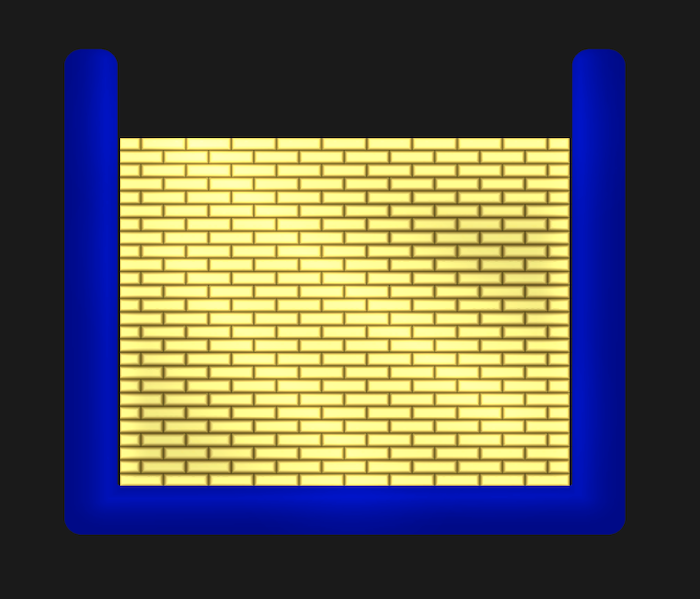
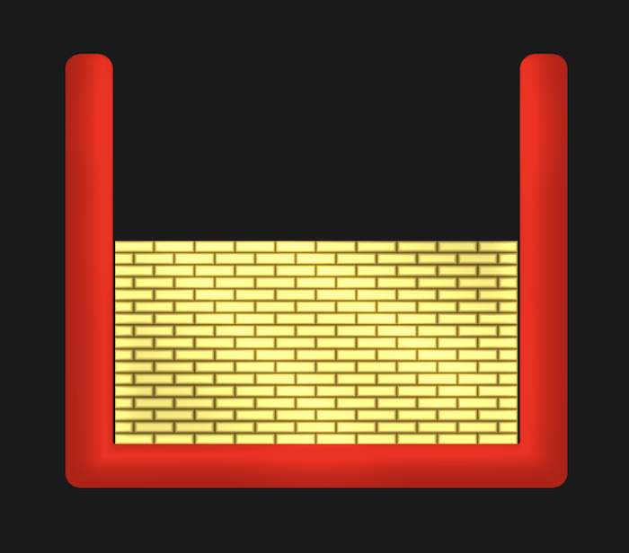

# Task
### Patch-LSD (Leave Stay Decision)

This document describes key points behind this implementation of the Patch-LSD (Leave Stay Decision) task.\
There are minor differences in functionality between device builds and the <a  href="https://i-brnrd.github.io/patchLSD/"  target="_blank">web version</a> outlined in this document.

### Contents
* [Overview](#overview)
* [Patches](#patches-reward-data)
* [Training](#training)
    * [Training A](#training-a)
    * [Training B](#training-b)
    * [Training C](#training-b)
* [Task](#task-1)
    * [Pausing](#pausing)
    * [Presentation Orders](#order-randomisation)
    * [Data Out](#data)
        * [Behavioural (Choice) Data](#behavioural-data)
        * [EEG Stream](#eeg-data)

## Overview
The task is designed to elucidate switching behaviour as a function of time linked reward rates. To place the following in context, read the <a  href="https://doi.org/10.1038/ncomms12327"  target="_blank">original paper</a> and play a few rounds of the task in the <a  href="https://i-brnrd.github.io/patchLSD/"  target="_blank">web version</a>.

On load, the Main Menu will appear. Two modes are available to the experimenter or participant; [Training (A, B & C)](#training) & [Task](#task-1).\
If training mode is selected, no data is stored or written out. On devices, the task can be paused and restarted via <kbd>Esc</kbd>. On the <a  href="https://i-brnrd.github.io/patchLSD/"  target="_blank">web version</a>., clicking away from the browser should pause; and to return to the main menu; just refresh the browser.

**Task Summary**\
Participants are presented with different patches that present rewards at different rates. In a patch, both reward events and non-reward events are presented. Between events, a fixation cross is shown.\
Patches consist of a coloured box. In non-reward events, this box is empty, and in reward events, the box is filled to a given level with an illustration of gold bars.

**Blue (Changing) Environment:**\
The **blue box** indicates a patch with a changing reward rate (i.e. the rate changes with timestep).

| Empty Box| Reward Box (level varies) |
| --- | --- |
|  |  |

**Red (Default) Environment:**\
The **red box** indicates a stable (default) reward rate that participants learn during [training](#training).
| Empty Box| Reward Box (level varies) |
| --- | --- |
|  |  |

After a (varying) number of events in a **blue box** patch, participants are asked to decide whether to stay in that **blue box** patch, or leave to go to a **red box** patch via a leave-stay decision

 

## Patches/ Reward Data
The raw patch reward schedules were taken directly from data provided by Marco Wittman. The raw data can be found [here](/Assets/Resources/RewardData/) (also there are [plots](/Assets/Resources/Literature/MarcoRR.html) of the patch reward rates provided).\
The reward schedules were generated from 18 reward rate curves using the iterative method described in the <a  href="https://doi.org/10.1038/ncomms12327"  target="_blank">original paper</a> (we did not re-generate these for this project). There were 18 reward rate curves from each of which 5 [raw patch reward schedules](/Assets/Resources/RewardData/) were generated, giving a total of 90 patches.\
Two points to note:
* In the [datasets](/Assets/Resources/RewardData/), the maximum reward $R_{max} = 0.35$. On [load](/Assets/Scripts/GameData.cs) we linearly scale rewards from $0-1$, so $R_{max}$ corresponds to a full box of [gold bars](/Assets/Scripts/Box.cs). It is these max normalised values that are written out as behavioural data.
* Unity uses C# for scripting which uses zero-based indexing (as in C, Python). Neuro researchers use MATLAB as standard, which uses one-based indexing (as in Fortran ♥).\
Though care has been taken to write out behavioural/EEG datasets using 1-based indexing, within scripts, zero-based will be used.

## Training
No data is stored/ written out to files in the training sessions. Pausing via <kbd>Esc</kbd> allows return to main menu,  no training progress is saved.

The aim of the training is to familiarise the participant with the task, and with the stable reward rate in the default (red) environment.\
The training options A, B & C are only briefly described here, and are implemented as set out in the <a  href="https://static-content.springer.com/esm/art%3A10.1038%2Fncomms12327/MediaObjects/41467_2016_BFncomms12327_MOESM821_ESM.pdf"  target="_blank"> supplementary material</a> of the <a  href="https://doi.org/10.1038/ncomms12327"  target="_blank">original paper</a>.

The [participant instructions](/Assets/Resources/Instructions/) give experimenters more detailed descriptions of how to to deliver the training and the task.\
Note below, Unity uses C# for scripting which uses zero-based indexing (like python).

### Training A:

[Training A](/Assets/Scripts/TrainingAController.cs) aims to familiarise the participants with the reward rate in the default patch, and consists of 10 trials each comprising two length-matched patches (each containing 15 events; so a total of 30 events per trial). See <a  href="https://static-content.springer.com/esm/art%3A10.1038%2Fncomms12327/MediaObjects/41467_2016_BFncomms12327_MOESM821_ESM.pdf"  target="_blank"> supplementary material</a> for further details.\
First **red** (default) is presented, then **blue** (changing).
After this, a decision screen is presented to ask which environment the participant prefers.\
The 10 length matched patches are presented in the order below:
 $$ \text{Trials A } \coloneqq\{18, 42, 86, 27, 65, 39, 76, 4, 13, 53\}$$
These were selected to give a variety of scenarios (i.e. best decision is either to leave or stay with varying magnitudes). To alter the patches presented in Training A, change the following in the [controller script](/Assets/Scripts/TrainingAController.cs) (noting C# zero based indices):

    int[] trialsA = { 17, 41, 85, 26, 64, 38, 75, 3, 12, 52 };

The rewards presented in Training A use [ldgo.csv](/Assets/Resources/RewardData/ldgo.csv) for **red** (default) and [ldstay.csv](/Assets/Resources/RewardData/ldstay.csv) for  **blue** (changing).

### Training B:
[Training B](/Assets/Scripts/TrainingBController.cs) aims to familiarise the participants with monotonically changing reward rates, and consists of 3 repeats of a set of 3 'full' **blue** (changing) patches; as below:
$$\text{Trials B } \coloneqq \{8, 42, 82\}$$

    int[] trialsB = { 7, 41, 81 };

 Again, further information is in the [participant instructions](/Assets/Resources/Instructions/)  and the <a  href="https://static-content.springer.com/esm/art%3A10.1038%2Fncomms12327/MediaObjects/41467_2016_BFncomms12327_MOESM821_ESM.pdf"  target="_blank"> supplementary material</a>.
The rewards presented in Training B use a full **blue** (changing) patch, so for a given patch rewards run through [rew2ld.csv](/Assets/Resources/RewardData/rew2ld.csv) and then onto  [ldstay.csv](/Assets/Resources/RewardData/ldstay.csv) with no Leave-Stay decision.

During the first set, participants are asked to pay attention to the change in reward magnitudes (ignoring delays). In the second set, participants are asked to pay attention to the change of reward delays (ignoring reward magnitudes), and in the final set, to the changes in both magnitudes and delays.

### Training C:
[Training C](/Assets/Scripts/TrainingCController.cs) is a shortened (18 trials) version of the experimental task including leave-stay
decisions and post leave-stay decision presentations (no truncations). Participants are given performance feedback after each trial.\
The 18 trials use 18 [randomly selected](#order-randomisation) patches from the full task set.

## Task
Participants are presented with all [90 changing patches](/Assets/Resources/RewardData/) (visualised [here](/Assets/Resources/Literature/MarcoRR.html)) in an evenly distributed [random order](#order-randomisation).

After the [patch](/Assets/Resources/RewardData/rew2ld.csv) is presented, the participant is presented with the Leave Stay Decision screen.\
To indicate the decision phase, a question mark is shown on screen for 2s. Then two buttons are diplayed; one for leave and one for stay. The positions switch randomly at each Leave Stay Decision.
Once a selelction is made, the choice is [recorded](), and is highlighted in yellow for 2 seconds, and the task continues.\
To shorten the experiment, 60% of trials are truncated post LSD. If a trial has not been selected for [truncation](#order-randomisation) then the patch chosen is presented; and feedback follows. If the trial has been selected for [truncation](#order-randomisation) then the post Leave Stay Decision patch is not shown, and the feedback is presented immediately.

Feedback takes the form of points. The points are calculated as follows:

    if (leave == true)
        {

            points = ldGoSum - ldStaySum;

        }
        else
        {
            points = ldStaySum - ldGoSum;
        }

Such that an incorrect decision will have a negative number of points, and a correct decision a positive number of points.\
After 1/4, 1/2 and 3/4 of the task, the total bonus points accumulated are displayed. At these points in the <a  href="https://i-brnrd.github.io/patchLSD/"  target="_blank">web version</a>; the option to download data is offered (to mitigate the risk of data loss as persistant data is difficult to access in a browser).

The task plays right through the 90 trials unless paused & resumed (see below); and at the end the [behavioural data](#behavioural-data) can be saved as a `.zip` as well as being recoverable from the device-specific [locally stored](https://docs.unity3d.com/ScriptReference/Application-persistentDataPath.html) data.

### Pausing
Training, plus the full 90 trials,can take a while to run through; especially if an EEG setup is used.\
As a result there is a 'Resume' option in the **device builds**. This utilises the device-specific [locally stored](https://docs.unity3d.com/ScriptReference/Application-persistentDataPath.html) data. There is not this option in the web builds as the code has no control over what data persists across browser sessions.

If the participant's task was started with a Unique PiD, the 'root' folder for the participant will be named as that `unique-PiD`. The participant's task can be resumed by entering that PiD and selecting 'Resume Acquisition'. If you forgot to enter a PiD, the data is still saved (and resumable)- look in the [locally stored](https://docs.unity3d.com/ScriptReference/Application-persistentDataPath.html) behavioural data. The default root folder will be named as a timestamp taken at task start, `YYYY-MM-DD-HH-MM-SS`. This folder name can be used as PiD to resume.

Each 'session' will be saved under a folder in the 'root' with the name `DATA_YYYY-MM-DD-HH-MM-SS` so that it is clear when data was obtained.

Pause-resume behaviour will picks up from the last finished trial, and uses [locally stored](https://docs.unity3d.com/ScriptReference/Application-persistentDataPath.html) data using `STATE/...` which saves `state.log` for a given trial number in the task, and also `presentationOrder.log` and `truncationOrder.log` to ensure the state of the task persists.
#
Note that the <a  href="https://i-brnrd.github.io/patchLSD/"  target="_blank">web version</a> can't be paused and restarted via a Participant ID. Instead, to pause, just click away from the browser.

## Order Randomisation
**Order**\
The 90 [patches](/Assets/Resources/RewardData/) (see [plots](/Assets/Resources/Literature/MarcoRR.html)) are created from 18 different reward rate curves. Each curve was used to seed 5 different patches; which are in row order as batches of 5 in the raw data.\
Patches drawn from the same reward rate curve must not be presented consecutively.
As such, on task start; the patch presentation order is [randomised](/Assets/Scripts/PatchUtilities.cs) while keeping the distribution evenly spread across the original curves.\
A similar implementation is used to [truncate](/Assets/Scripts/PatchUtilities.cs) 60% of the trials, by randomly truncating 3 of every 5 trials in the task.\
These are determined and stored at the start of each task as `presentationOrder.log` and `truncationOrder.log` to ensure the state of the task can persist.

## Data

The task reads out EEG stream data and beavioural (choice) data. [Behavioural data](/TASK/Data) is written to the (device specific) [Unity Application Persistent Data Path](https://docs.unity3d.com/ScriptReference/Application-persistentDataPath.html).

**On completion** of the task, the option to download zipped data should be presented.\
On a **device build**; selecting the 'Download Data' button should open a file browser dialogue to save a .zip of the data.\
On the <a  href="https://i-brnrd.github.io/patchLSD/"  target="_blank">**web version**</a>; selecting the 'Download Data' button should prompt a message allow downloads from the host (in this case github). On the web, there is the option to download at points throughout the task.

### Behavioural Data

The `leave` variable in the scripts is a nullable boolean. Post-LSD, it takes either `True` (1) or `False` (0), where 1 = leave, 0 = stay, following convention.
Also note that on [load](/Assets/Scripts/GameData.cs) we linearly scale rewards from $0-1$, it is these max normalised values that are written out as behavioural data, not the [unnormalised raw rewards](/Assets/Resources/RewardData/).

The behavioural data directories are `Participant_Root/DATA_YYYY-MM-DD-HH-MM-SS/` where `YYYY-MM-DD-HH-MM-SS` is the timestamp for that session start.\ In th
We write out 5 datatsets and 1 log file, as follows:

| File  | Contains |
| -------- | ------- |
| `init.log` | Timestamp for task start/ resume |
| `Choice.txt`| Leave-Stay Decision (Trial No, Patch No, And Leave? 1 = Leave, 0 = Stay) |
| `RewardToLSD.txt`  | Rewards from Patch Start to LSD (in order as presented)  |
| `LDStay.txt` | Rewards from LSD to end if Stay (in order as presented) |
| `LDLeave.txt` | Rewards from LSD to end if Leave (in order as presented)  |
| `PostLSD.txt` | What was actually presented (single 0 indicates truncation)  |

### EEG Data

To streamline EEG integration, triggers take the form of event specific methods in the [eegStream script](/Assets/Scripts/EegStream.cs). This approach also allowed device-specific directives (i.e. WebGL builds won't look for an EEG stream).

#### Task Events & Messages (LSL Markers)

Events in the code trigger messages sent over the LSL stream.\
Note there is a 1s delay between the first spacebar press and the first fixaton cross appearing (to prevent events/ messages overlapping).

| Event   | Message |
| -------- | ------- |
| Task Begins (first spacebar press)  | 'Start'   |
| Box Presentation |e.g. ‘1101013500' (see below) |
| Choice Phase Begins (? presented)   | '7'  |
| LSD Options Presented  | '8'  |
| Leave Decision  | '4000'  |
| Stay Decision  | '3000'  |
| Stay Decision  | '3000'  |

**Box Presentation Key:**

| Digit   | Meaning | Key|
| -------- | ------- | ------|
| 1st  | Environment Colour | 1 = Blue; 2 = Red |
| 2nd  | Pre/Post LSD | 1 = Pre; 2 = Post |
| 3rd & 4th |Step No | 01-17 |
| 5th & 6th | Trial Number | 01-90 (in order)  |
| 7th & 8th | Patch Number | 01-90 (random)  |
| 9th & 10th  | Box %age Full  | 00-99 (i.e. $R*99$)|

Examples:

 Message  | Meaning
| -------- | -------
| ‘1101013500'  | Blue, Pre LSD, 1st Step (pre LSD), 1st trial, Patch 35, Empty (00%)  |
| '1205481850' |Blue, Post LSD, 5th Step (post LSD), 48th trial, Patch 18, Half Full (50%) |
| '2204162705' | Red, Post LSD, 4th Step (post LSD), 16th trial, Patch 27, Nearly Empty (5% full)|
