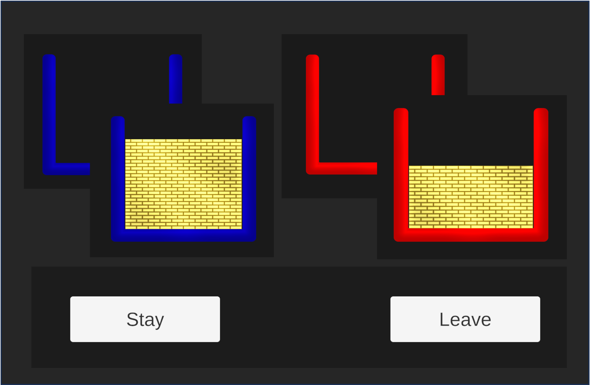

# Task
### Patch-LSD (Leave Stay Decision)

This document describes key points behind this implementation of the Patch-LSD (Leave Stay Decision) task.

## The Task
The task is designed to elucidate switching behaviour as a function of time linked reward rates. To place the following in context, read the <a  href="https://doi.org/10.1038/ncomms12327"  target="_blank">original paper</a> and play a few rounds of the task in the <a  href="https://i-brnrd.github.io/patchLSD/"  target="_blank">demo version</a>.

#### Overview
Participants are presented with different patches that present rewards at different rates. In a patch, both reward events and non-reward events are presented.\
Patches consist of a coloured box. In non-reward events, this box is empty, and in reward events, the box is filled to a given level with an illustration of gold bars.

**Blue (Changing) Environment:**\
The **blue box** indicates a patch with a changing reward rate (i.e. the rate changes with timestep).\
**Red (Default) Environment:**\
The **red box** indicates a stable (default) reward rate.

After a (varying) number of events in a **blue box** patch, participants are asked to decide whether to stay in that **blue box** patch, or leave to go to a **red box** patch (with a stable reward rate that participants have learned during training).

On load, the Main Menu will appear. Two modes are available to the experimenter or participant; Training (A, B & C) & Task.\
If training mode is selected, no data is stored or written out.

On devices, the task can be paused and restarted via <kbd>Esc</kbd>. On the WebGL version, clicking away from the browser will pause- to return to the main menu; just refresh the browser.

#### Patch/ Reward Data
The raw patch reward schedules were taken directly from data provided by Marco Wittman; and can be found [here](/Assets/Resources/RewardData/).\
The reward schedules were generated using the iterative method described in the <a  href="https://doi.org/10.1038/ncomms12327"  target="_blank">original paper</a>; please note we did not re-generate these for this project.\
Two points to note:
* In the [datasets](/Assets/Resources/RewardData/), the maximum reward $R_{max} = 0.35$. On [load](/Assets/Scripts/GameData.cs) we linearly scale rewards from $0-1$, so $R_{max}$ corresponds to a full box of [gold bars](/Assets/Scripts/Box.cs). It is these max normalised values that are written out as behavioural data.
* Unity uses C# for scripting which uses zero-based indexing (as in C, Python). Neuro researchers use MATLAB as standard, which uses one-based indexing (as in Fortran ♥).\
Though care has been taken to write out behavioural/EEG data in 1-based indexing, within scripts, be aware zero-based will be used.

## Training
No data is stored/ written out to files in the training sessions. Pausing via <kbd>Esc</kbd> allows return to main menu,  no training progress is saved.

The aim of the training is to familiarise the participant with the task, and with the stable reward rate in the default (red) environment.\
The training options A, B & C are only briefly described here, and are implemented as set out in the <a  href="https://static-content.springer.com/esm/art%3A10.1038%2Fncomms12327/MediaObjects/41467_2016_BFncomms12327_MOESM821_ESM.pdf"  target="_blank"> supplementary material</a> of the <a  href="https://doi.org/10.1038/ncomms12327"  target="_blank">original paper</a>.

The [participant instructions](/Assets/Resources/Instructions/) give experimenters more detailed descriptions of how to to deliver the training and the task.

### Training A:

Training A (see [script](/Assets/Scripts/TrainingAController.cs)) aims to familiarise the participants with the reward rate in the default patch, and consists of 10 trials each comprising two length-matched patches (each containing 15 events; so a total of 30 events per trial). See <a  href="https://static-content.springer.com/esm/art%3A10.1038%2Fncomms12327/MediaObjects/41467_2016_BFncomms12327_MOESM821_ESM.pdf"  target="_blank"> supplementary material</a> for further details.\
First **red** (default) is presented, then **blue** (changing).
After this, a decision screen is presented to ask which environment the participant prefers.\
The 10 length matched patches are presented in the order below:
$$\{18, 42, 86, 27, 65, 39, 76, 4, 13, 53\}$$
These were selected to give a variety of scenarios (better to leave or stay with varying magnitudes). To alter the patches presented in Training A, change the following in the [controller script](/Assets/Scripts/TrainingAController.cs) (noting C# zero based indices):

    int[] trialsA = { 17, 41, 85, 26, 64, 38, 75, 3, 12, 52 };

The rewards presented in Training A use [ldgo.csv](/Assets/Resources/RewardData/ldgo.csv) for **red** (default) and [ldstay.csv](/Assets/Resources/RewardData/ldstay.csv) for  **blue** (changing).

### Training B FINISH:
Training B aims to familiarise the participants with reward rates.
Training B (see [script](/Assets/Scripts/TrainingBController.cs)) consists of 3 repeats stepping through full patches (as in, they had no decision they coukd not leave that patch ) of a set of 3 trials
$$\{8, 42, 82\}$$

    int[] trialsB = { 7, 41, 81 };

Fruther information is in LINK LINK LINK INSTRUCTIONS and the <a  href="https://static-content.springer.com/esm/art%3A10.1038%2Fncomms12327/MediaObjects/41467_2016_BFncomms12327_MOESM821_ESM.pdf"  target="_blank"> supplementary material</a>; but in summary:

The rewards presented in Training A use a full **blue** (changing) patch, so for a given patch runs through [rew2ld.csv](/Assets/Resources/RewardData/rew2ld.csv) and then onto  [ldstay.csv](/Assets/Resources/RewardData/ldstay.csv).

First Set: 1. in the fist set; participants are asked to pay attention to The instructions were to pay attention to 1) the change in reward magnitudes
(ignoring delays) 2) the change of reward delays (ignoring reward magnitudes) and 3) the change in
both magnitudes and delay. Th
 of 10 trials each comprising two length-matched patches (15 each; so a total of 30).\
In trainin
3 x
    3 repeats (?) of a full blue patch; i.e rew2ld + stay. Which ine?

### Training C:
18 trials of task + POINTS displayed (fixed pattern)

## Task:
Participants are presented with all 90 blue patch in **blue** (changing).
After the patch presented up to the  [rew2ld.csv](/Assets/Resources/RewardData/rew2ld.csv) the participant is presented with the leave stay decision screen. In this ti sows a quesiton mark for however many seconds nad then
THe positions of leav eand stary bittons are ransomised.  Very smple Each trial is
Run through eac of the 90 patches in a radmosied order.
Some are truncated post decision (ie don't show the post decision patches)
After
Blue patch for 15/16/17 events.

Events are reward or non reward (drawn from Marco's task data*)

Leave-Stay Decision

Either

-Stay in Blue patch

-Leave for Red patch (default)

Each quarter of experiment, subjects recieve feedback about Bonus Points- done

60% of trials were truncated after the LSD- done?

We need to decide whether orders of these should be fixed or not and

* Patches drawn from same reward rate curve must not be presented concurrently

#### Order Randomisation
To allow for pausing/ restarting over sessions (the task can be long) for each initial

They are done using
for Patch orfe; the original data is ficidied into it's just a simple select from
The rtuncation order: similar but we randomise a setevery 3.
90 trials drawn from data provided by Marco.

###

## EEG Data

### Triggers
Triggers are found througout the code; event specific methods in the [eegStream script](/Assets/Scripts/EegStream.cs). This was to streamline the EEG integration & allowed device specific directives (i.e. WebGL builds won't look for it allows a device sepcidic directive easily.
Tehy look liek         eegStream.LogButtonsAppear();
but wrao in. Events all call an EEg stream internal methid LogMessage taht ten uses  lslStream.TriggerLSLEvent(message);

### Events & Messages (LSL Markers)

<ins>**Beginning of main task**</ins>

*event:* first spacebar press

*trigger:* **‘start’**

*1 second delay after 1st spacebar press to allow time for trigger to not overlap with the next one.

#### Patch Events

*event:* box appearance

*trigger:* **‘1013500, 1024850, 2116275, etc.’**

1st digit: environment colour – **1 = blue, 2 = red**

2nd & 3rd digits: step number – **01-17**

4th & 5th digits: reward curve (patch) number – **01-90**

5th & 6th digits: box content, % full – **00-99**

<ins>**Choice**</ins>

*event:* Question mark onset

*trigger:* **‘7’**

...

*event:* Appearance of LSD

*trigger:* **‘8’**

...

*event:* Click on decision

*trigger:* **‘30000’ = stay; ‘40000’ = leave**

<ins>**Feedback**</ins>

*event:* Feedback appearance

*trigger:* amount of points **‘+46, -135, +230, etc.’**
